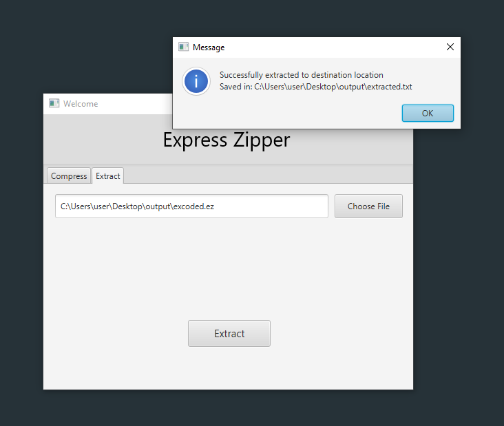
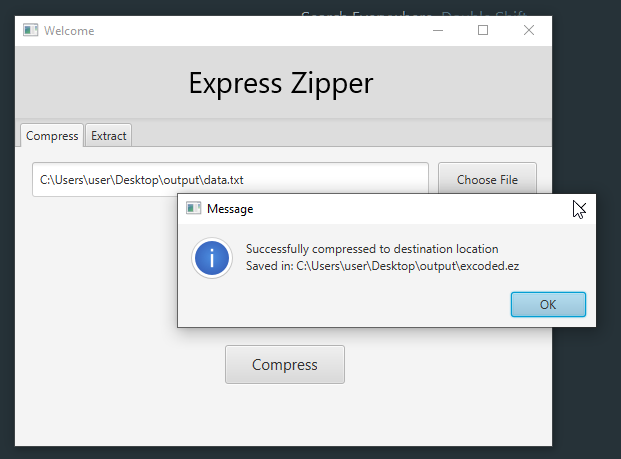

## File Compressor GUI Application
This javafx based gui application can encode a text file via huffman algorithm and save to a file with extension `.ez`. Also can retrieve back to original text file by extractor.

|  Extractor     |  Compressor   |  
|:-:   |:-:   |  
|      |      |

|  Extractor success message     |  Compressor  success message |  
|:-:   |:-:   |  
|      |      |

